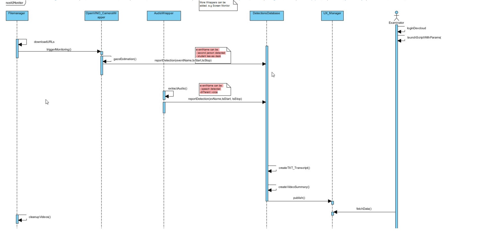

# edu_poc
# OpenVINO for AiProc in Education

## Content:

\-Instructions

\- Design and Requirements

\-Example

\-PoC


# Instructions:

-   login to your DevCloud machine and copy testFolder content from this repo into the HOME folder of DevCloud

-   run the preprocess.sh script and check the console results log file date_Y_m_d.log

# Design
Preconditions:

1.
It is mandatory to place the input file with this name
download_links_for_intel.csv
the row header of the CSV file should have following format and column names
```
entryid	name	parentDownloadUrl	childDownloadUrl
```
the home folder should contain the following empty tree structure before starting the script
```
mkdir -p ~/testFolder/raw_videos/work/
```

2.
In case not already installed on your machine/DevCloud, install the following Python3 packages:

pip3 install moviepy
pip3 install numpy

pip3 install opencv-python


The script is started by running commands
```
cd ~/testFolder
./preprocess.sh
```

The high level design is summarized in 




# Requirements and features
Only post processing required, not in run time.
Input: one session / student / exam 

Define Anomaly detection:
Additional face in the camera
human voice on the microphone
Camera is off
Microphone is off

Face recognition:
Output expected to be smaller video or marking the timestamps in the video. 
Identify from video who is taking the exam (name of the person)
What happens when we get an anomaly (an additional face

Voice recognition:
Expected that there is no human noise. Any spoken word is flagged.

# Project components

-	mp4 downloader
-	movie editor ( label overlay using opencv  +  multi-clips stitching using moviepy)
-	OpenVINO json file parser
-	file infrastructure administration ( e.g. creation of separate folder with summary.mp4 and transcript.txt for each student name in the csv file).
The scripts are generating the following output tree:
```
> output_videos
> ..Student name
> .....summary.mp4
> .....transcript.-txt
```

# Results
Copy all directories in a separate folder
```
u44194@s099-n018:~/testFolder/raw_videos$ mv dir_* outputsummary/
```

Archive all files with 
```
tar -zcvf archiveSummaries.tar.gz outputsummary/
```

Sort all files with
```
du -ah ~/testFolder/raw_videos/outSummary/ | sort -rh | head -6
```


Expected output is:
```
Output is'''
u44194@s099-n018:~/testFolder/raw_videos/outSummary$ du -ah ~/testFolder/raw_videos/outSummary/ | sort -rh | head -6
1.3M    /home/u44194/testFolder/raw_videos/outSummary/
672K    /home/u44194/testFolder/raw_videos/outSummary/dir_SusanneBetrugsversuch.mp4
664K    /home/u44194/testFolder/raw_videos/outSummary/dir_SusanneBetrugsversuch.mp4/summary.mp4
212K    /home/u44194/testFolder/raw_videos/outSummary/dir_Betrugsversuch1.mp4
212K    /home/u44194/testFolder/raw_videos/outSummary/dir_Betrugsversuch122.mp4
208K    /home/u44194/testFolder/raw_videos/outSummary/dir_Betrugsversuch2.mp4
```

 
